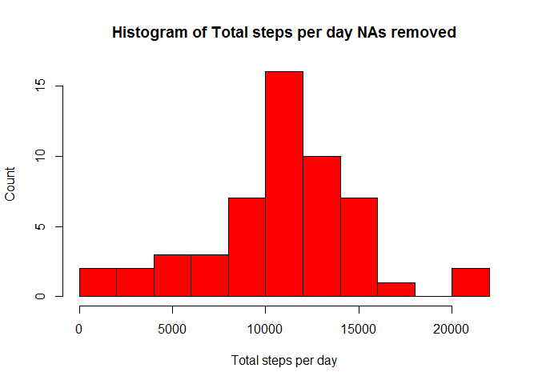
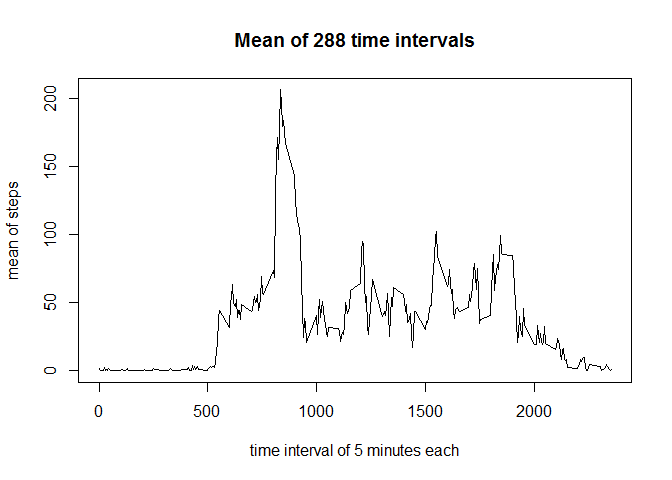
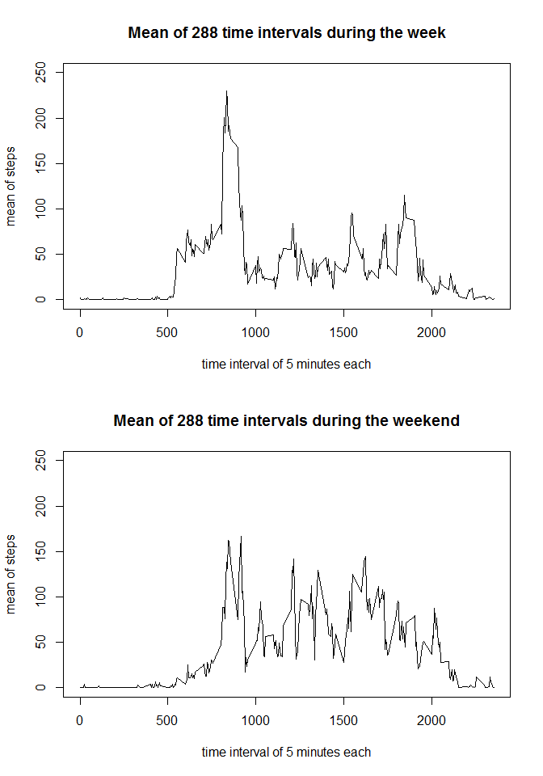

# Reproducible Research: Peer Assessment 1


## Loading and preprocessing the data


```r
# unzips the file repdata-data-activity.zip in the data folder and
# stores the result activity.csv in the data file
unzip(zipfile="./data/repdata-data-activity.zip",exdir="./data")

# amd =  activity monitoring data
amd = read.csv('data/activity.csv', header = TRUE)

# removes all observations that includes NA's
amd_omit <- na.omit(amd)

# loads dplyr
library(dplyr)
```

```
## 
## Attaching package: 'dplyr'
## 
## The following object is masked from 'package:stats':
## 
##     filter
## 
## The following objects are masked from 'package:base':
## 
##     intersect, setdiff, setequal, union
```

## The code for the sum of total number of steps taken per day
## and histogram with NA's removed.


```r
# finds sum of the steps by date
amd_sum <- amd_omit %>%
  group_by(date) %>%
  summarise(total_steps = sum(steps))

# creates the histogram 'Total steps per day NA's removed'
hist(amd_sum$total_steps,
  xlab='Total steps per day',
  main='Histogram of Total steps per day NAs removed',
  ylab='Count',
  breaks = 11,
  col = "Red")
```

 

### finds the median and the mean of the steps by date
### with the NA's removed


```r
# finds the median and the mean of the steps by date
amd_mean_median <- amd_omit %>%
  group_by(date) %>%
  summarise(median = median(steps), mean = mean(steps))
amd_mean_median
```

```
## Source: local data frame [53 x 3]
## 
##          date median     mean
## 1  2012-10-02      0  0.43750
## 2  2012-10-03      0 39.41667
## 3  2012-10-04      0 42.06944
## 4  2012-10-05      0 46.15972
## 5  2012-10-06      0 53.54167
## 6  2012-10-07      0 38.24653
## 7  2012-10-09      0 44.48264
## 8  2012-10-10      0 34.37500
## 9  2012-10-11      0 35.77778
## 10 2012-10-12      0 60.35417
## ..        ...    ...      ...
```

## The code for average daily activity pattern and plot.


```r
# finds the mean across all the dates of each interval
amd_interval <- amd_omit %>%
  group_by(interval) %>%
  summarise(mean = mean(steps))

# creates the line graph 
plot(amd_interval$interval,
  amd_interval$mean, 
  type = 'l',
  main = 'Mean of 288 time intervals',
  xlab='time interval of 5 minutes each', 
  ylab='mean of steps')
```

 

### 5-minute interval which contains the maximum number of steps


```r
# finds the maximum mean of all intervals
max_interval <- filter(amd_interval, mean == max(mean))

# 5-minute interval which contains the maximum number of steps
max_interval
```

```
## Source: local data frame [1 x 2]
## 
##   interval     mean
## 1      835 206.1698
```
### Total NA's


```r
# sum of all NA's
na_sum <- sum(is.na(amd$steps)) + sum(is.na(amd$date)) + sum(is.na(amd$interval))
na_sum
```

```
## [1] 2304
```
## Imputing missing values
### replaces all NA's of amd with the mean of the each interval of amd_interval

```r
# replaces all NA's of amd with the mean of the each interval of amd interval
amd_fixed <- transform(amd, 
  steps = ifelse(is.na(amd$steps), 
  amd_interval$mean[match(amd$interval,
  amd_interval$interval)], 
  amd$steps))
```

## The code for the sum of total number of steps taken per day
## and histogram with NA's replaced


```r
# finds the sum of the steps by date
amd_fixed_sum <- amd_fixed %>%
  group_by(date) %>%
  summarise(total_steps = sum(steps))

# creates the histogram 'Total steps per day NA's replaced'
hist(amd_fixed_sum$total_steps,
  xlab='Total steps per day',
  main='Histogram of Total steps per day NAs replaced',
  ylab='Count',
  breaks = 11,
  col = "Green")
```

 

#### The NA's are located in eight different days. The total number of
#### NA's are 2304, which if divide by 288, the number of intervals, equals 8.
#### So the removing the NA's only effects the individual eight days.
#### Consequently the total number of steps is increased.

### finds the median and the mean of the steps by date
### with the NA's replaced


```r
# finds the median and the mean of the steps by date
amd_fixed_mean_median <- amd_fixed %>%
  group_by(date) %>%
  summarise(median = median(steps), mean = mean(steps))

amd_fixed_mean_median
```

```
## Source: local data frame [61 x 3]
## 
##          date   median     mean
## 1  2012-10-01 34.11321 37.38260
## 2  2012-10-02  0.00000  0.43750
## 3  2012-10-03  0.00000 39.41667
## 4  2012-10-04  0.00000 42.06944
## 5  2012-10-05  0.00000 46.15972
## 6  2012-10-06  0.00000 53.54167
## 7  2012-10-07  0.00000 38.24653
## 8  2012-10-08 34.11321 37.38260
## 9  2012-10-09  0.00000 44.48264
## 10 2012-10-10  0.00000 34.37500
## ..        ...      ...      ...
```

## The code for differences in activity patterns between
## weekdays and weekends and plot.


```r
# adds a column with days that corresponds to dates
amd_fixed$day <- weekdays(as.Date(amd_fixed$date))

# includes only the days Monday, Tuesday, Wednesday, Thursday and Friday.
amd_week <- filter(amd_fixed, day == 'Monday' | day == 'Tuesday' | day == 'Wednesday'|
  day == 'Thursday' | day == 'Friday')

# includes only the days Saturday and Sunday
amd_weekend <- filter(amd_fixed, day == 'Sunday' | day == 'Saturday')

# finds the mean across all the dates of each interval
amd_week_interval <- amd_week %>%
  group_by(interval) %>%
  summarise(mean = mean(steps))

# finds the mean across all the dates of each interval
amd_weekend_interval <- amd_weekend %>%
  group_by(interval) %>%
  summarise(mean = mean(steps))

# sets the graphics to two rows, one column.
par(mfrow=c(2,1))

# plots a line graph
plot(amd_week_interval$interval,
  amd_week_interval$mean, 
  type = 'l',
  ylim = c(0,250),
  main = 'Mean of 288 time intervals during the week',
  xlab='time interval of 5 minutes each', 
  ylab='mean of steps')

# plots a line graph
plot(amd_weekend_interval$interval,
  amd_weekend_interval$mean, 
  type = 'l',
  ylim = c(0,250),
  main = 'Mean of 288 time intervals during the weekend',
  xlab='time interval of 5 minutes each', 
  ylab='mean of steps')
```

 

```r
# resets the graphics to one row, one column.
par(mfrow=c(1,1))
```

### Note that x and y scales of the two graphs are identical.
#### Upon examination it appears during week the there is greater
#### activity from 500 to 1000.  After 1000 there is greater activity
#### during the weekend, until about 1800.
