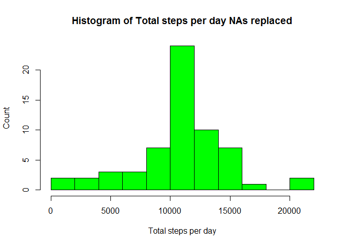

# Reproducible Research: Peer Assessment 1


## Loading and preprocessing the data


```r
echo = TRUE
# unzips the file repdata-data-activity.zip in the data folder and
# stores the result activity.csv in the data file
unzip(zipfile="./data/repdata-data-activity.zip",exdir="./data")

# amd =  activity monitoring data
amd = read.csv('data/activity.csv', header = TRUE)

# removes all observations that includes NA's
amd_omit <- na.omit(amd)

# loads dplyr
library(dplyr)
```

```
## 
## Attaching package: 'dplyr'
## 
## The following object is masked from 'package:stats':
## 
##     filter
## 
## The following objects are masked from 'package:base':
## 
##     intersect, setdiff, setequal, union
```

## The code for the sum of total number of steps taken per day
## and histogram with NA's removed.


```r
# finds sum of the steps by date
amd_sum <- amd_omit %>%
  group_by(date) %>%
  summarise(total_steps = sum(steps))

# creates the histogram 'Total steps per day NA's removed'
hist(amd_sum$total_steps,
  xlab='Total steps per day',
  main='Histogram of Total steps per day NAs removed',
  ylab='Count',
  breaks = 11,
  col = "Red")
```

 

### finds the median and the mean of the steps by date
### with the NA's removed


```r
# finds the median and the mean of the steps by date
amd_mean_median <- amd_omit %>%
  group_by(date) %>%
  summarise(median = median(steps), mean = mean(steps))
print(amd_mean_median, n = 53)
```

```
## Source: local data frame [53 x 3]
## 
##          date median       mean
## 1  2012-10-02      0  0.4375000
## 2  2012-10-03      0 39.4166667
## 3  2012-10-04      0 42.0694444
## 4  2012-10-05      0 46.1597222
## 5  2012-10-06      0 53.5416667
## 6  2012-10-07      0 38.2465278
## 7  2012-10-09      0 44.4826389
## 8  2012-10-10      0 34.3750000
## 9  2012-10-11      0 35.7777778
## 10 2012-10-12      0 60.3541667
## 11 2012-10-13      0 43.1458333
## 12 2012-10-14      0 52.4236111
## 13 2012-10-15      0 35.2048611
## 14 2012-10-16      0 52.3750000
## 15 2012-10-17      0 46.7083333
## 16 2012-10-18      0 34.9166667
## 17 2012-10-19      0 41.0729167
## 18 2012-10-20      0 36.0937500
## 19 2012-10-21      0 30.6284722
## 20 2012-10-22      0 46.7361111
## 21 2012-10-23      0 30.9652778
## 22 2012-10-24      0 29.0104167
## 23 2012-10-25      0  8.6527778
## 24 2012-10-26      0 23.5347222
## 25 2012-10-27      0 35.1354167
## 26 2012-10-28      0 39.7847222
## 27 2012-10-29      0 17.4236111
## 28 2012-10-30      0 34.0937500
## 29 2012-10-31      0 53.5208333
## 30 2012-11-02      0 36.8055556
## 31 2012-11-03      0 36.7048611
## 32 2012-11-05      0 36.2465278
## 33 2012-11-06      0 28.9375000
## 34 2012-11-07      0 44.7326389
## 35 2012-11-08      0 11.1770833
## 36 2012-11-11      0 43.7777778
## 37 2012-11-12      0 37.3784722
## 38 2012-11-13      0 25.4722222
## 39 2012-11-15      0  0.1423611
## 40 2012-11-16      0 18.8923611
## 41 2012-11-17      0 49.7881944
## 42 2012-11-18      0 52.4652778
## 43 2012-11-19      0 30.6979167
## 44 2012-11-20      0 15.5277778
## 45 2012-11-21      0 44.3993056
## 46 2012-11-22      0 70.9270833
## 47 2012-11-23      0 73.5902778
## 48 2012-11-24      0 50.2708333
## 49 2012-11-25      0 41.0902778
## 50 2012-11-26      0 38.7569444
## 51 2012-11-27      0 47.3819444
## 52 2012-11-28      0 35.3576389
## 53 2012-11-29      0 24.4687500
```

## The code for average daily activity pattern and plot.


```r
# finds the mean across all the dates of each interval
amd_interval <- amd_omit %>%
  group_by(interval) %>%
  summarise(mean = mean(steps))

# creates the line graph 
plot(amd_interval$interval,
  amd_interval$mean, 
  type = 'l',
  main = 'Mean of 288 time intervals',
  xlab='time interval of 5 minutes each', 
  ylab='mean of steps')
```

 

### 5-minute interval which contains the maximum number of steps


```r
# finds the maximum mean of all intervals
max_interval <- filter(amd_interval, mean == max(mean))

# 5-minute interval which contains the maximum number of steps
max_interval
```

```
## Source: local data frame [1 x 2]
## 
##   interval     mean
## 1      835 206.1698
```
### Total NA's


```r
# sum of all NA's
na_sum <- sum(is.na(amd$steps)) + sum(is.na(amd$date)) + sum(is.na(amd$interval))
na_sum
```

```
## [1] 2304
```
## Imputing missing values
### replaces all NA's of amd with the mean of the each interval of amd_interval

```r
# replaces all NA's of amd with the mean of the each interval of amd interval
amd_fixed <- transform(amd, 
  steps = ifelse(is.na(amd$steps), 
  amd_interval$mean[match(amd$interval,
  amd_interval$interval)], 
  amd$steps))
```

## The code for the sum of total number of steps taken per day
## and histogram with NA's replaced


```r
# finds the sum of the steps by date
amd_fixed_sum <- amd_fixed %>%
  group_by(date) %>%
  summarise(total_steps = sum(steps))

# creates the histogram 'Total steps per day NA's replaced'
hist(amd_fixed_sum$total_steps,
  xlab='Total steps per day',
  main='Histogram of Total steps per day NAs replaced',
  ylab='Count',
  breaks = 11,
  col = "Green")
```

 

#### The NA's are located in eight different days. The total number of
#### NA's are 2304, which if divide by 288, the number of intervals, equals 8.
#### So the removing the NA's only effects the individual eight days.
#### Consequently the total number of steps is increased.

### finds the median and the mean of the steps by date
### with the NA's replaced


```r
# finds the median and the mean of the steps by date
amd_fixed_mean_median <- amd_fixed %>%
  group_by(date) %>%
  summarise(median = median(steps), mean = mean(steps))

print(amd_fixed_mean_median, n = 61)
```

```
## Source: local data frame [61 x 3]
## 
##          date   median       mean
## 1  2012-10-01 34.11321 37.3825996
## 2  2012-10-02  0.00000  0.4375000
## 3  2012-10-03  0.00000 39.4166667
## 4  2012-10-04  0.00000 42.0694444
## 5  2012-10-05  0.00000 46.1597222
## 6  2012-10-06  0.00000 53.5416667
## 7  2012-10-07  0.00000 38.2465278
## 8  2012-10-08 34.11321 37.3825996
## 9  2012-10-09  0.00000 44.4826389
## 10 2012-10-10  0.00000 34.3750000
## 11 2012-10-11  0.00000 35.7777778
## 12 2012-10-12  0.00000 60.3541667
## 13 2012-10-13  0.00000 43.1458333
## 14 2012-10-14  0.00000 52.4236111
## 15 2012-10-15  0.00000 35.2048611
## 16 2012-10-16  0.00000 52.3750000
## 17 2012-10-17  0.00000 46.7083333
## 18 2012-10-18  0.00000 34.9166667
## 19 2012-10-19  0.00000 41.0729167
## 20 2012-10-20  0.00000 36.0937500
## 21 2012-10-21  0.00000 30.6284722
## 22 2012-10-22  0.00000 46.7361111
## 23 2012-10-23  0.00000 30.9652778
## 24 2012-10-24  0.00000 29.0104167
## 25 2012-10-25  0.00000  8.6527778
## 26 2012-10-26  0.00000 23.5347222
## 27 2012-10-27  0.00000 35.1354167
## 28 2012-10-28  0.00000 39.7847222
## 29 2012-10-29  0.00000 17.4236111
## 30 2012-10-30  0.00000 34.0937500
## 31 2012-10-31  0.00000 53.5208333
## 32 2012-11-01 34.11321 37.3825996
## 33 2012-11-02  0.00000 36.8055556
## 34 2012-11-03  0.00000 36.7048611
## 35 2012-11-04 34.11321 37.3825996
## 36 2012-11-05  0.00000 36.2465278
## 37 2012-11-06  0.00000 28.9375000
## 38 2012-11-07  0.00000 44.7326389
## 39 2012-11-08  0.00000 11.1770833
## 40 2012-11-09 34.11321 37.3825996
## 41 2012-11-10 34.11321 37.3825996
## 42 2012-11-11  0.00000 43.7777778
## 43 2012-11-12  0.00000 37.3784722
## 44 2012-11-13  0.00000 25.4722222
## 45 2012-11-14 34.11321 37.3825996
## 46 2012-11-15  0.00000  0.1423611
## 47 2012-11-16  0.00000 18.8923611
## 48 2012-11-17  0.00000 49.7881944
## 49 2012-11-18  0.00000 52.4652778
## 50 2012-11-19  0.00000 30.6979167
## 51 2012-11-20  0.00000 15.5277778
## 52 2012-11-21  0.00000 44.3993056
## 53 2012-11-22  0.00000 70.9270833
## 54 2012-11-23  0.00000 73.5902778
## 55 2012-11-24  0.00000 50.2708333
## 56 2012-11-25  0.00000 41.0902778
## 57 2012-11-26  0.00000 38.7569444
## 58 2012-11-27  0.00000 47.3819444
## 59 2012-11-28  0.00000 35.3576389
## 60 2012-11-29  0.00000 24.4687500
## 61 2012-11-30 34.11321 37.3825996
```

## The code for differences in activity patterns between
## weekdays and weekends and plot.


```r
# adds a column with days that corresponds to dates
amd_fixed$day <- weekdays(as.Date(amd_fixed$date))

# includes only the days Monday, Tuesday, Wednesday, Thursday and Friday.
amd_week <- filter(amd_fixed, day == 'Monday' | day == 'Tuesday' | day == 'Wednesday'|
  day == 'Thursday' | day == 'Friday')

# includes only the days Saturday and Sunday
amd_weekend <- filter(amd_fixed, day == 'Sunday' | day == 'Saturday')

# finds the mean across all the dates of each interval
amd_week_interval <- amd_week %>%
  group_by(interval) %>%
  summarise(mean = mean(steps))

# finds the mean across all the dates of each interval
amd_weekend_interval <- amd_weekend %>%
  group_by(interval) %>%
  summarise(mean = mean(steps))

# sets the graphics to two rows, one column.
par(mfrow=c(2,1))

# plots a line graph
plot(amd_week_interval$interval,
  amd_week_interval$mean, 
  type = 'l',
  ylim = c(0,250),
  main = 'Mean of 288 time intervals during the week',
  xlab='time interval of 5 minutes each', 
  ylab='mean of steps')

# plots a line graph
plot(amd_weekend_interval$interval,
  amd_weekend_interval$mean, 
  type = 'l',
  ylim = c(0,250),
  main = 'Mean of 288 time intervals during the weekend',
  xlab='time interval of 5 minutes each', 
  ylab='mean of steps')
```

 

```r
# resets the graphics to one row, one column.
par(mfrow=c(1,1))
```

### Note that x and y scales of the two graphs are identical.
#### Upon examination it appears during week the there is greater
#### activity from 500 to 1000.  After 1000 there is greater activity
#### during the weekend, until about 1800.
